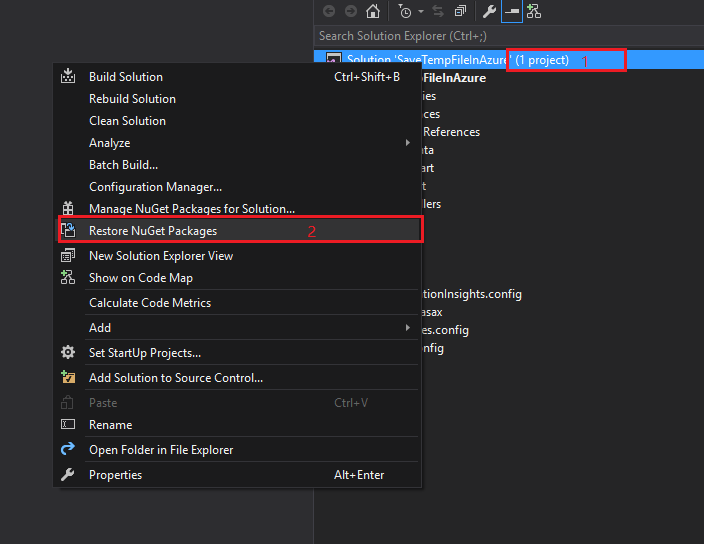

# Store temp files by Azure Blob storage on Azure applications
This sample demonstrates how to store temp files by Azure Blob storage in Azure applications

## Introduction 
This sample demonstrates how to store temp file in Azure applications. 


We have two solutions： 

1. First one is traditional way to call ‘Path.GetTempPath()’ to store temp file in all windows platform 
2. The other is azure specific way to use blob object in Azure to simulate temp file.  

## Building the Sample
1. Double click CSAzureTempFiles.sln file to open this sample solution by using Microsoft Visual Studio 2012 or the later version(s). 
2. Restore nugget packages in the solution 

3.	Copy account name, access key and address of your azure storage account.
4.	Configure necessary parameters about account name, key and address in the solution in file Controllers\AzureBlobController.cs
 
## Running the Sample
You can upload the sample to your Azure storage, or run at your local IIS, or just debug it in your Visual Studio.
Using the Code

Solution1:
```cs
private void SaveTempFile(HttpPostedFileBase file)
{
    //get the uploaded file name
    string fileName = file.FileName;

    //get temp directory path
    string tempPath = Path.GetTempPath();

    //init the file path
    string filePath = tempPath + fileName;

    //if the path is exists,delete old file
    if (System.IO.File.Exists(filePath))
    {
        System.IO.File.Delete(filePath);
    }

    //and then save new file
    file.SaveAs(filePath);
}
```
Solution 2: 
```cs
private async Task SaveTempFile(string fileName, long contentLenght, Stream inputStream)
{
    try
    {
        //firstly, we need check the container if exists or not. And if not, we need to create one.
        await container.CreateIfNotExistsAsync();

        //init a blobReference
        CloudBlockBlob tempFileBlob = container.GetBlockBlobReference(fileName);

        //if the blobReference is exists, delete the old blob
        tempFileBlob.DeleteIfExists();

        //check the count of blob if over limit or not, if yes, clear them.
        await CleanStorageIfReachLimit(contentLenght);

        //and upload the new file in this
        tempFileBlob.UploadFromStream(inputStream);
    }
    catch (Exception ex)
    {
        if (ex.InnerException != null)
        {
            throw ex.InnerException;
        }
        else
        {
            throw ex;
        }
    }
}

//check the count of blob if over limit or not, if yes, clear them. 
private async Task CleanStorageIfReachLimit(long newFileLength)
{
    List<CloudBlob> blobs = container.ListBlobs()
        .OfType<CloudBlob>()
        .OrderBy(m => m.Properties.LastModified)
        .ToList();

    //get total size of all blobs.
    long totalSize = blobs.Sum(m => m.Properties.Length);

    //calculate out the real limit size of before upload
    long realLimetSize = TotalLimitSizeOfTempFiles - newFileLength;

    //delete all,when the free size is enough, break this loop,and stop delete blob anymore
    foreach (CloudBlob item in blobs)
    {
        if (totalSize <= realLimetSize)
        {
            break;
        }

        await item.DeleteIfExistsAsync();
        totalSize -= item.Properties.Length;
    }
} 
```
## More Information and Resources
- Microsoft Azure storage documents: [https://azure.microsoft.com/en-us/documentation/services/storage](https://azure.microsoft.com/en-us/documentation/services/storage)
